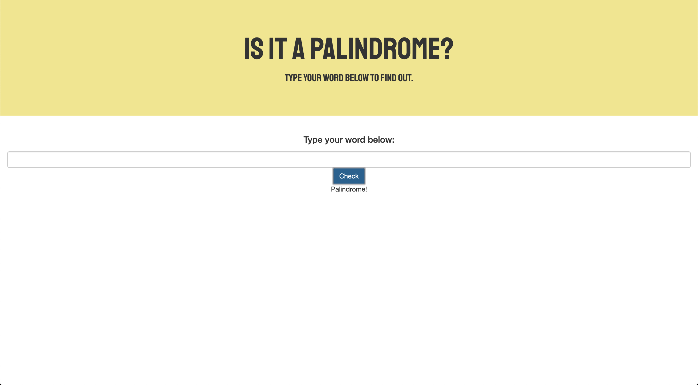

# Is It A Palindrome?

### Overview
---
"Is It A Palindrome?" was born out an inside joke with a friend and I where we would respond with "Is that a palindrome?" randomly after the other person said a word.

To operate the tool, simply type in any word or phrase and press the "Check" button. It was eliminate any special characters, capital letters, or spaces, and check if the input is the same forward and reverse, and then determine whether or not it is a palindrome. Have fun!
---

---
### Technologies Used:
- HTML
- CSS
- Javascript
- jQuery
- Bootstrap